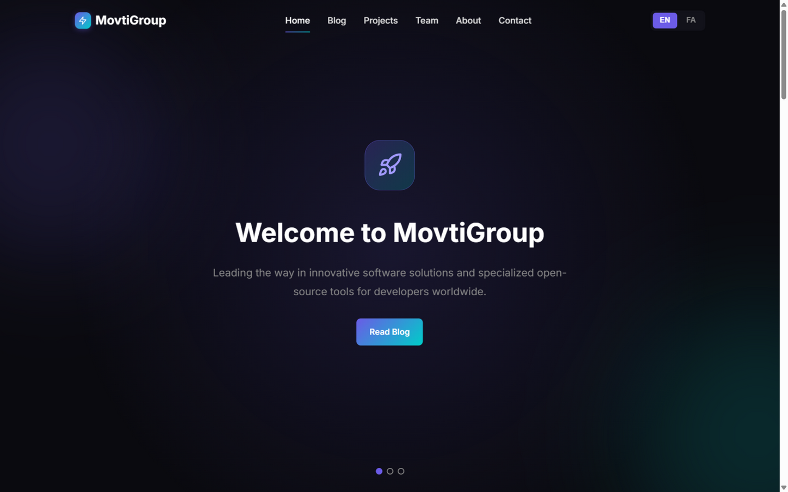
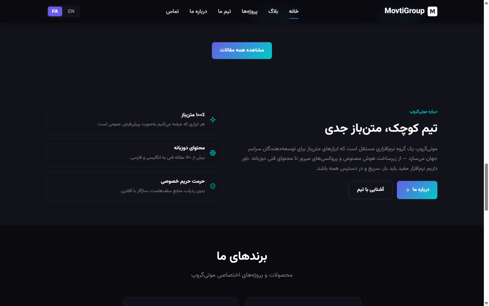
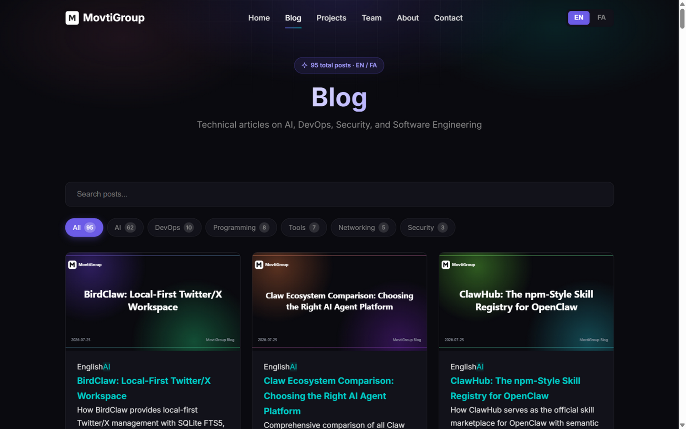
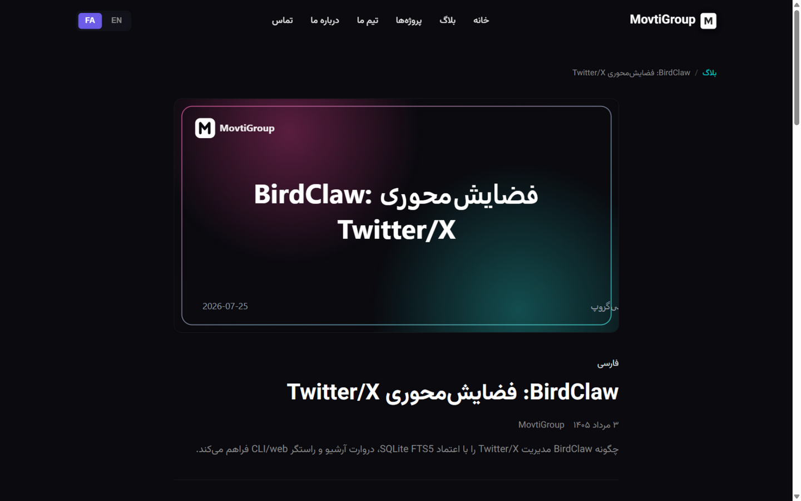
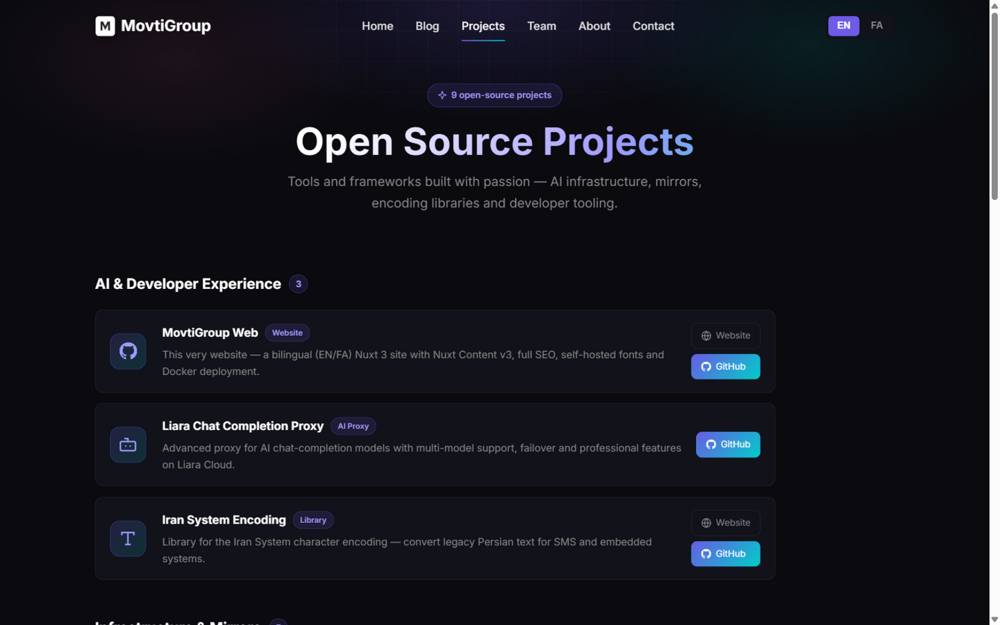
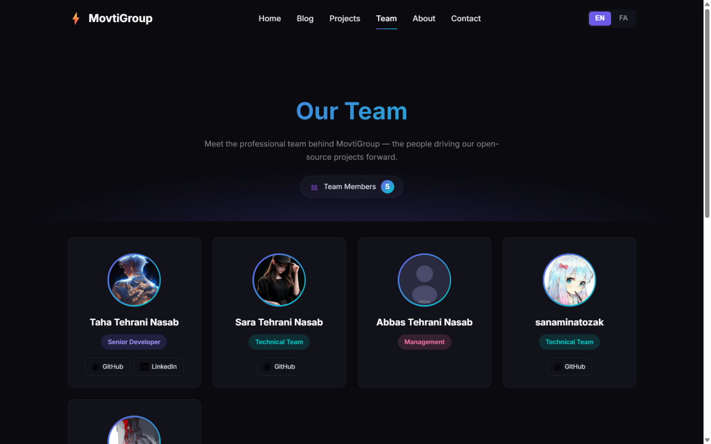

# MovtiGroup Official Website

[](https://github.com/movtigroup/movtigroup-web/actions/workflows/ci.yml)
[](https://github.com/movtigroup/movtigroup-web/releases)
[](https://nuxt.com)
[](https://vuejs.org)
[](LICENSE)

Modern corporate website built with **Nuxt 3**, **Nuxt Content v3**, and **Vue 3**. Bilingual (English / فارسی) with full SEO, self-hosted fonts, and one-command Docker deployment — everything runs on **port 3002**.

[🇮🇷 نسخه فارسی](README.fa.md)

## 📸 Screenshots

| English (LTR) | فارسی (RTL) |
|:---:|:---:|
|  |  |

| Blog | Blog Post | Projects | Team |
|:---:|:---:|:---:|:---:|
|  |  |  |  |

## ✨ Features

- **Nuxt 3 + Vue 3** — SSR rendering with Nitro server preset
- **Bilingual (EN/FA)** — `@nuxtjs/i18n` v9 with `prefix_except_default` strategy, full RTL support
- **SEO-first** — dynamic `sitemap.xml` (160+ URLs), `robots.txt`, per-page canonical URLs, hreflang alternates, Open Graph / Twitter cards, JSON-LD structured data (`WebSite`, `BlogPosting`, `BreadcrumbList`)
- **Fully self-hosted fonts** — [Vazirmatn](https://fontsource.org/fonts/vazirmatn) (Persian) + [Inter](https://fontsource.org/fonts/inter) (English) bundled locally via Fontsource — zero CDN requests, works offline
- **Blog engine** — 95 English + 65 Farsi articles via `@nuxt/content` v3 with syntax highlighting
- **Animated UI** — scroll-reveal sections, page transitions, hero entrance effects, animated stat counters — all CSS-driven and `prefers-reduced-motion` friendly
- **three.js + anime.js** — WebGL particle sphere in the hero and orchestrated entrance/counter animations (lazy-loaded, performance-conscious)
- **Client-side search** with category filtering
- **Docker-ready** — multi-stage build, health checks, nginx reverse proxy included
- **GitHub Actions** — CI (build + SSR smoke tests + content validation + Docker) and automated tag & release pipeline

## 🚀 Quick Start

> **Requires:** Node.js ≥ 22

```bash
git clone https://github.com/movtigroup/movtigroup-web.git
cd movtigroup-web

npm install --legacy-peer-deps

# Development server → http://localhost:3002
npm run dev
```

### Production

```bash
npm run build
npm run start          # serves .output on port 3002
```

Every entry point defaults to **port 3002** (dev, preview, production, Docker). Override at any time with the `PORT` environment variable.

## 🌐 Deployment

### Vercel

1. Import the repository into Vercel — the Nuxt framework is auto-detected.
2. Add the environment variable `NUXT_PUBLIC_SITE_URL=https://movtigroup.me` (your domain).
3. Deploy. Serverless functions handle SSR automatically; no port configuration is needed on Vercel.

> On Vercel the platform manages the listening port, and `NUXT_PUBLIC_SITE_URL` keeps canonical/OG URLs correct on your custom domain.

### Dokploy

1. Create a new **Docker Compose** or **Application** service pointing at this repository.
2. Dokploy builds the included `Dockerfile` — the app listens on **3002** and `EXPOSE 3002` is already set.
3. Health check path: `/api/health`.
4. Set `NUXT_PUBLIC_SITE_URL` to your public URL and bind your domain in Dokploy.

### Docker / Docker Compose

```bash
docker compose up -d --build     # app on http://localhost:3002 (nginx proxy on :80)

# or plain docker
docker build -t movtigroup-web .
docker run -p 3002:3002 movtigroup-web
```

## 🔌 Port 3002 Everywhere

| Context | Port | Configured by |
|---|---|---|
| `npm run dev` | **3002** | `--port 3002` + `devServer` in `nuxt.config.ts` |
| `npm run preview` | **3002** | `--port 3002` |
| `npm run start` | **3002** | `scripts/start.mjs` (defaults `PORT=3002`) |
| Docker | **3002** | `ENV PORT=3002` + `EXPOSE 3002` + health check |
| nginx proxy | **3002** | `nginx.conf` upstream |

The port can still be overridden with `PORT` / `NUXT_PORT` environment variables — 3002 is just the default so containers (Vercel/Dokploy/self-hosted) come up consistently.

## 📁 Project Structure

```
movtigroup-web/
├── .github/
│   ├── workflows/ci.yml        # CI: build + SSR smoke tests + content validation + Docker
│   └── workflows/release.yml   # Tag & GitHub Release (starts at v0.0.1)
├── assets/css/main.css         # Global styles (dark theme, RTL aware)
├── components/                 # Navbar.vue, Footer.vue
├── composables/useBlog.ts      # Content v3 queries + localized post links
├── content/                    # Blog posts (Markdown)
│   ├── en/blog/                # English posts (95)
│   └── fa/blog/                # Farsi posts (65)
├── content.config.ts           # Content v3 collections (blog_en / blog_fa)
├── i18n/                       # en.json / fa.json translations
├── pages/                      # index, blog, projects, teams, about, contact, collaborations, search
├── public/                     # favicon.svg, robots.txt, og-image.png
├── scripts/start.mjs           # Production entry (defaults to port 3002)
├── server/
│   ├── api/health.ts           # Health check endpoint
│   └── routes/sitemap.xml.ts   # Dynamic sitemap from content collections
├── Dockerfile                  # Multi-stage build (port 3002)
├── docker-compose.yml          # App + optional nginx proxy
├── nginx.conf                  # Reverse proxy tuned for :3002
└── nuxt.config.ts
```

## 📝 Writing Blog Posts

Create a Markdown file in `content/en/blog/` or `content/fa/blog/`:

```markdown
---
title: "Your Post Title"
date: 2026-01-15
lang: en
category: "AI"
author: "MovtiGroup"
description: "A brief description of your post"
---

Your content here...
```

- File name becomes the URL: `content/en/blog/my-post.md` → `/blog/my-post` (English) and `content/fa/blog/my-post.md` → `/fa/blog/my-post` (Persian).
- Keep EN and FA file names identical so the sitemap can pair hreflang alternates.
- Every post automatically gets `BlogPosting` JSON-LD, OG tags, a sitemap entry, and a branded cover image — after adding posts run `npm run generate:covers` to regenerate cover art in `public/covers/`.

## 🔍 SEO Checklist (built in)

- ✅ Dynamic `sitemap.xml` with hreflang alternates (EN ↔ FA)
- ✅ `robots.txt` pointing at the sitemap
- ✅ Canonical URL per page (i18n-aware)
- ✅ Open Graph + Twitter cards with `public/og-image.png` (1200×630)
- ✅ JSON-LD: `WebSite` + `SearchAction`, `BlogPosting`, `BreadcrumbList`
- ✅ Semantic HTML (`<article>`, breadcrumbs, heading hierarchy)
- ✅ `lang`/`dir` attributes per locale, Vazirmatn/Inter with `font-display: swap`
- ✅ Search page excluded from indexing (`noindex`)

> Tip for ranking: submit `https://movtigroup.me/sitemap.xml` in [Google Search Console](https://search.google.com/search-console), keep publishing bilingual articles (the blog ships 160+), and earn backlinks via the open-source projects on the Projects page.

## 🔧 Environment Variables

| Variable | Default | Description |
|---|---|---|
| `PORT` | `3002` | Production listening port |
| `HOST` | `0.0.0.0` | Bind address |
| `NUXT_PUBLIC_SITE_URL` | `https://movtigroup.me` | Canonical/OG/sitemap base URL |

Copy `.env.example` to `.env` for local overrides.

## 🧪 Testing

```bash
npm run build      # production build
npm run start      # serve on :3002 and verify
curl http://localhost:3002/api/health
```

CI runs the same checks automatically: multi-Node build matrix, SSR smoke tests for every EN/FA route, SEO endpoint assertions, content/frontmatter validation, and a full Docker container test.

## 🏷️ Releases

Run the **Release** workflow (Actions → Release → Run workflow). With no input it starts at **v0.0.1** and auto-bumps the patch on each run; you can also type an explicit semver (e.g. `0.1.0`). The workflow tags the repo, syncs `package.json`, attaches build notes and a zip of `.output`.

## 🏗️ Architecture

See [docs/ARCHITECTURE.md](docs/ARCHITECTURE.md) for the full architecture, conventions and project memory (stack decisions, data flow, taxonomy, covers pipeline).

## 🙏 Credits

- Brand icons: [icons.lobehub.com](https://icons.lobehub.com) (`@lobehub/icons-static-svg`) + [simple-icons](https://simpleicons.org)
- Design language inspired by [ui.lobehub.com](https://ui.lobehub.com)
- Animation: [three.js](https://threejs.org), [anime.js](https://animejs.com), [Fontsource](https://fontsource.org) fonts (Vazirmatn, Inter)

## 🛠️ Utility Scripts

| Script | Purpose |
|---|---|
| `scripts/start.mjs` | Production entry point (port 3002 default) |
| `check-github-token.sh` | Verify a `GH_TOKEN` has repo scope |
| `verify-ci-cd.sh` | Local sanity checks mirroring parts of CI |

## 📄 License

Released under the [MIT License](LICENSE).

## 🤝 Contributing

Contributions are welcome — see [CONTRIBUTING.md](CONTRIBUTING.md).

<div align="center">

Made with ❤️ by **MovtiGroup**

</div>
